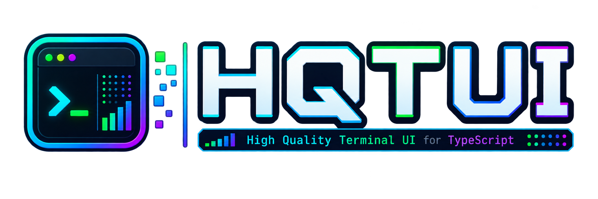
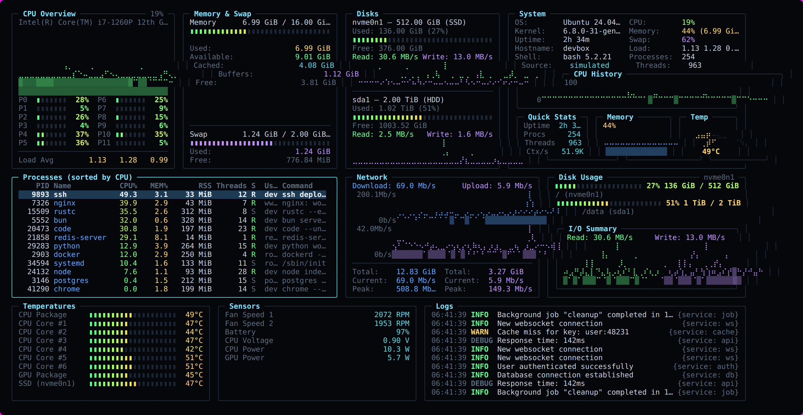

<p align="center">
  
</p>
<p align="center"><strong>High Quality Terminal UI</strong><br>
btop-grade dashboards with a one-import API, dark by default, zero runtime dependencies.<br>
TypeScript, Rust, Go, Python, Zig, C++, Ruby, PHP and Perl.</p>
<p align="center">
  <a href="https://hqtui.com">hqtui.com</a> ·
  <a href="https://www.npmjs.com/package/@profullstack/hqtui">npm</a> ·
  <a href="https://hqtui.com/docs">docs</a> ·
  <a href="https://bbs.hqtui.com/">discussions</a>
</p>
<p align="center">
  <a href="https://nodejs.org"></a>
  <a href="https://bun.sh"></a>
  <a href="https://deno.com"></a>
</p>
<p align="center">
  <a href="ports/rust/"></a>
  <a href="ports/go/"></a>
  <a href="ports/python/"></a>
  <a href="ports/zig/"></a>
  <a href="ports/cpp/"></a>
  <a href="ports/bindings/"></a>
  <a href="ports/bindings/"></a>
  <a href="ports/bindings/"></a>
</p>



<p align="center"><em>Every screenshot on this page is a real frame from <code>hqtui-demo</code>, captured at 2x.</em></p>

Run it yourself on whichever runtime you already have:

```bash
bunx @profullstack/hqtui-demo                    # Bun
npx  @profullstack/hqtui-demo                    # Node 22.6+
deno run -A npm:@profullstack/hqtui-demo         # Deno 2
```

The same ten-screen demo runs natively in eight other languages, one command
each and no checkout: see [See it running](#see-it-running).

Add `--sim` to any of them for a deterministic simulation instead of your real machine.

---

## Why

Terminal apps do not have to look like 1990s ncurses software. HQTUI owns the terminal
directly — ANSI/VT sequences, a typed-array framebuffer, differential rendering, Braille
graphics and truecolor — so a dashboard can look and feel like a modern desktop app
while starting instantly and running fine over SSH.

No ncurses. No browser DOM. No React. No native addon. No network access. Ever.

## Install

```bash
bun  add @profullstack/hqtui        # Bun is the default runtime
npm  add @profullstack/hqtui        # Node 22.6+ works too
deno add npm:@profullstack/hqtui    # Deno 2
```

The API below is the TypeScript reference implementation. Rust, Go, Python, Zig,
C++, Ruby, PHP and Perl each have their own idiomatic API over the same
rendering model: see [Other languages](#other-languages).

## Hello, terminal

```ts
import { createApp } from "@profullstack/hqtui";

const app = await createApp();

app.render(({ ui }) => {
  ui.panel({ title: "Hello" }, (panel) => {
    panel.text("Hello, terminal.");
  });
});

await app.start();
```

That is the whole API surface you need to start. `createApp()` already gives you a dark
theme, truecolor with automatic 256/16-colour fallback, mouse tracking, the alternate
screen, resize handling, 30fps adaptive rendering (15 over SSH), and a terminal that is
restored no matter how the process dies — Ctrl+C, SIGTERM, or an uncaught exception.

## A real dashboard

```ts
import { createApp } from "@profullstack/hqtui";

const app = await createApp({ fps: 30 });

app.render(({ ui, theme }) => {
  ui.grid({ columns: ["2fr", "1fr"], rows: [14, "1fr"], gap: 1 }, (grid) => {
    grid.panel({ title: "CPU" }, (p) => {
      p.graph({ values: cpuHistory, min: 0, max: 100, fill: true });
      p.meters(cores.map((value, i) => ({ label: `P${i}`, value })), { columns: 2 });
    });

    grid.panel({ title: "Memory" }, (p) => {
      p.meter({ label: "Used", value: 0.42, text: "6.7 GiB" });
      p.keyValues([{ label: "Cached", value: "4.0 GiB" }]);
    });

    grid.panel({ title: "Processes", colSpan: 2 }, (p) => {
      p.table({
        rows: processes,
        columns: [
          { key: "pid", title: "PID", width: 7, align: "right" },
          { key: "name", title: "Name" },
          { key: "cpu", title: "CPU%", width: 6, align: "right" },
        ],
      });
    });
  });
});

await app.start();
```

## See it running

Ten screens. Real metrics on Linux, macOS and Windows, with no native dependencies.

From npm, on any JavaScript runtime you already have:

```bash
bunx @profullstack/hqtui-demo                    # Bun
npx  @profullstack/hqtui-demo                    # Node 22.6+
deno run -A npm:@profullstack/hqtui-demo         # Deno 2
```

Every language runs that same demo through one launcher. It fetches current
`main` into a private cache, prints the exact commit it built, and leaves your
checkout alone. It is a shell script from the internet, so
[read it first](https://hqtui.com/demo.sh):

```bash
curl -fsSL https://hqtui.com/demo.sh | sh -s -- --system typescript
curl -fsSL https://hqtui.com/demo.sh | sh -s -- --system rust
curl -fsSL https://hqtui.com/demo.sh | sh -s -- --system go
curl -fsSL https://hqtui.com/demo.sh | sh -s -- --system python
curl -fsSL https://hqtui.com/demo.sh | sh -s -- --system zig
curl -fsSL https://hqtui.com/demo.sh | sh -s -- --system cpp
curl -fsSL https://hqtui.com/demo.sh | sh -s -- --system ruby
curl -fsSL https://hqtui.com/demo.sh | sh -s -- --system php
curl -fsSL https://hqtui.com/demo.sh | sh -s -- --system perl
```

`--system` uses the toolchain you already have installed. Swap it for `--mise`
and the launcher supplies a pinned one instead, so nothing but `mise` has to be
on the box. Demo arguments pass straight through: `--sim` for a deterministic
simulation, `--snapshot` for headless text where there is no TTY, and
`--screen traffic` to open on one tab.

From a checkout, `mise run demo:<language>` is the same thing, and
`mise run demo-local:<language>` runs your local edits without updating first.
Or run the examples directly:

```bash
bun apps/demo/src/main.ts                            # TypeScript
cd ports/rust   && cargo run --example dashboard     # Rust
cd ports/go     && go run ./examples/dashboard       # Go
cd ports/python && python examples/dashboard.py      # Python
cd ports/zig    && zig build run-dashboard           # Zig
```

C++, Ruby, PHP and Perl build a native library first; their READMEs have the
CMake invocation.

### Traffic — every protocol in and out of the host


Live sockets grouped by protocol, TCP/UDP/ICMP counters with retransmit rate, HTTP
request tracking parsed from nginx/apache access logs (req/s, status mix, top paths,
WebSocket upgrades), and sshd authentication events from the journal.

### Network — interfaces, connections, listening ports


### Sessions — who is on the box, and who tried


Active sessions from `who`, login history from wtmp, failed attempts from btmp, and a
process state breakdown.

### Services — units, containers, kernel, filesystems


systemd units with failures first, docker containers, kernel counters (context
switches, interrupts, forks, entropy, open file descriptors) and filesystems with
inode usage.

### Components — every widget in the library


### Themes


Nothing above needs root. Running with `sudo` additionally unlocks socket process
names, failed logins, HTTP access logs, per-process I/O and the full journal — the
demo tells you which of those it could not read.

## What is in the box

| | |
|---|---|
| **Layout** | rows, columns, grid with spans, `"40%"`, `"2fr"`, `auto`, min/max, padding, gaps, clipping, responsive breakpoints |
| **Widgets** | panel, table, tree, list, log viewer, key/values, meter, gauge, donut, progress, sparkline, line/area/multi-series graph, histogram, heat bar, tabs, status bar, button, checkbox, toggle, radio, select, text input, modal, command palette, tooltip, badge, divider |
| **Graphics** | Braille canvas (2×4 pixels per cell), block/half-block/quadrant/ASCII modes, gradients, software alpha blending |
| **Color** | 24-bit truecolor, automatic 256 and 16-colour quantization, `NO_COLOR`, monochrome and high-contrast modes |
| **Themes** | dark (default), dracula, nord, tokyo night, gruvbox, matrix, monochrome, high contrast, light — plus `defineTheme()` |
| **Input** | normalized keys with modifiers, SGR mouse (click, double-click, drag, scroll, move) delivered per widget — rows, status bar keys, dialog buttons and panels all take a click — bracketed paste, focus events, Tab focus traversal |
| **Testing** | headless renderer: `renderToText`, `renderToScreen`, `renderToAnsi`, `renderToHtml` — no TTY required |

## Testing your TUI

Terminal apps are usually untestable. Here they are not:

```ts
import { renderToScreen } from "@profullstack/hqtui";

const screen = renderToScreen(({ ui }) => ui.panel({ title: "CPU" }, (p) => p.text("72%")), {
  width: 40,
  height: 6,
});

expect(screen.contains("72%")).toBe(true);
expect(screen.cell(2, 0).fg).toBe(theme.title);
```

## Performance

The screen is one grid of cells in four typed arrays — no object is allocated per cell.
Each frame is diffed against the previous one and only the changed runs are written,
with a model of the terminal's pen so no redundant escape sequence is emitted.

Changing `CPU 72%` to `CPU 73%` writes a single character, not a screen.

```bash
bun run bench
```

```text
160x50 (8,000 cells) · bun 1.4 · linux x64
renderer.frame.unchanged     0.068ms     no output written
renderer.frame.1pct          0.140ms     627 bytes/frame
renderer.frame.10pct         0.291ms     2,639 bytes/frame
renderer.frame.100pct        1.409ms     8,341 bytes/frame
widgets.dashboard            0.425ms     6 panels, layout + widgets + diff
```

## Repository

```
packages/hqtui   the library
apps/demo        the reference dashboard (real + simulated data)
apps/web         hqtui.com
examples/        small, focused programs
ports/           Rust, Go, Python, Zig, C, C++ and the Ruby/PHP/Perl bindings
docs/            the original PRD
```

## Other languages

hqtui is not a TypeScript library that grew wrappers. Nine languages run the
same ten screens, and they stay honest against each other through a shared
corpus of golden fixtures — thirteen groups, roughly nine thousand reference
cells. The same widget arguments must produce the same cells, the same colors
and the same escape bytes, byte for byte.

| Language | What it is | Runtime deps | Docs |
|---|---|---|---|
| TypeScript | the reference implementation | none | [packages/hqtui](packages/hqtui/) |
| [Rust](ports/rust/) | native port | standard library only | [README](ports/rust/README.md) |
| [Go](ports/go/) | native port | standard library only | [README](ports/go/README.md) |
| [Python](ports/python/) | native port | standard library only | [README](ports/python/README.md) |
| [Zig](ports/zig/) | native port | standard library only | [README](ports/zig/README.md) |
| [C++](ports/cpp/) | native demo on the C core; library API experimental | none | [README](ports/cpp/README.md) |
| [Ruby](ports/bindings/) | binding over the shared C ABI | the native engine | [README](ports/bindings/README.md) |
| [PHP](ports/bindings/) | binding over the shared C ABI | the native engine | [README](ports/bindings/README.md) |
| [Perl](ports/bindings/) | binding over the shared C ABI | the native engine | [README](ports/bindings/README.md) |

The four native ports are ports, not bindings: no Node is in the picture at
runtime or at build time, and each is idiomatic in its own language rather than
a transliteration. The C11 core in [ports/c](ports/c/) is still in development
and has no demo of its own yet.

[ports/README.md](ports/README.md) has the details, and
[ports/TARGETS.md](ports/TARGETS.md) is the scored list of which language is
next.

## Discussions

Questions, showcases and bug reports have a home at
**[bbs.hqtui.com](https://bbs.hqtui.com/)** — a board running
[tsbb](https://github.com/profullstack/tsbb), themed to match this project. It
serves no client-side JavaScript, and `tsbb-tui` reads and posts to it from a
terminal, which felt like the right place for a terminal UI library to hold its
conversations.

## Runtimes

For the TypeScript implementation, Bun is the default. Node 22.6+ runs everything unchanged (it strips TypeScript natively).
Deno 2 runs the library and the demo through its npm compatibility layer (`deno run -A`);
it is exercised by hand rather than in CI. Tested on Linux, macOS and Windows Terminal; degrades
gracefully on limited terminals (no mouse, quantized color, ASCII instead of Braille).

## License

MIT.
